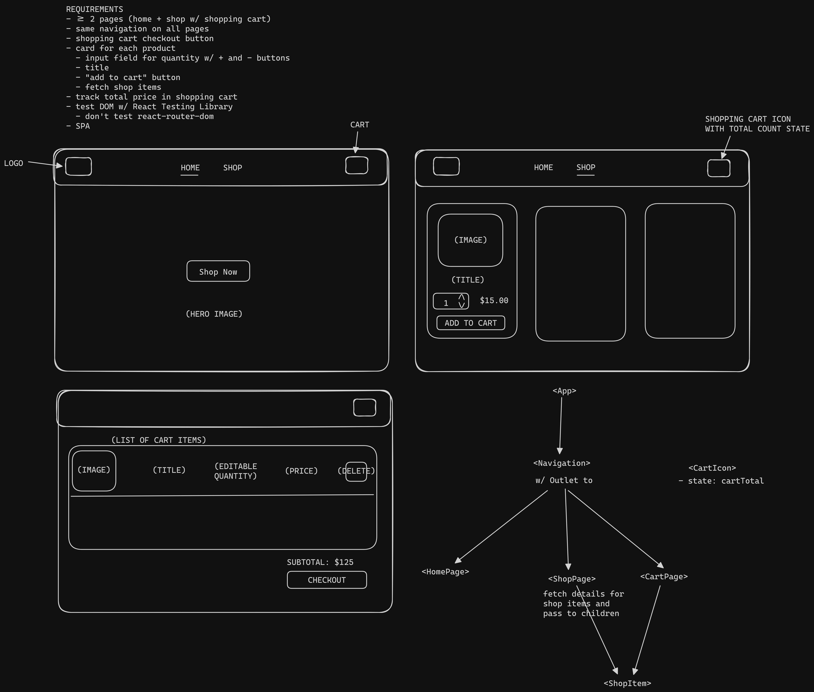

# Shopping Cart

<!-- [Live Demo]() -->

## Purpose

Practice testing the UI with React Testing Library, type checking with PropTypes, creating a Single Page Application with React Router, fetching data in React, and styling components with CSS modules.

## Planning

